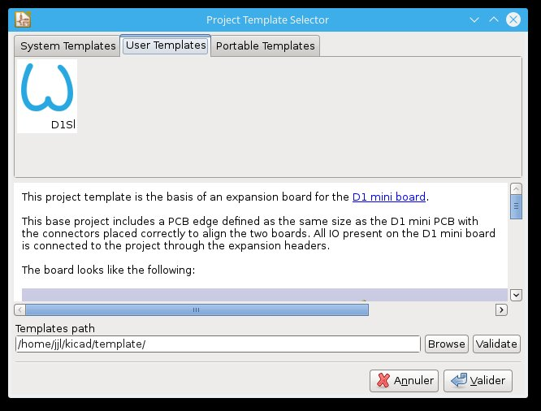
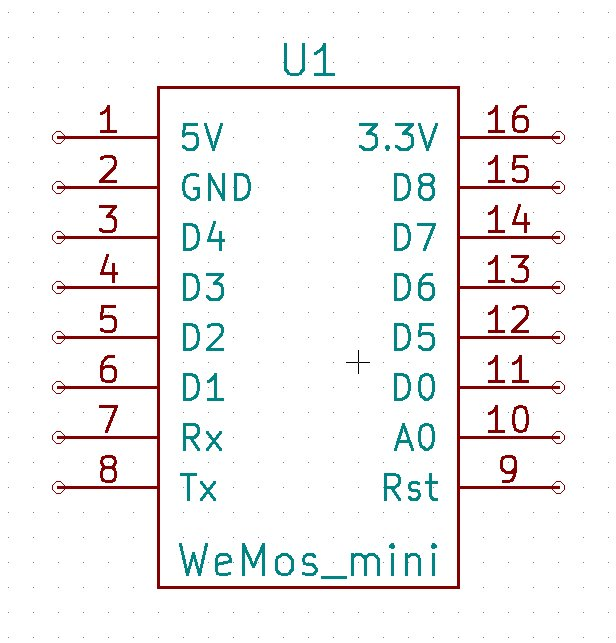
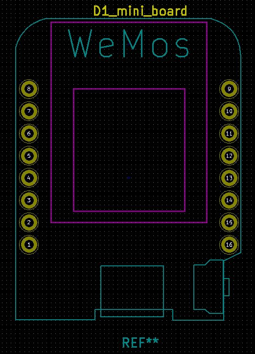

# Kicad tools for Wemos D1 mini

## Shields template
To create a new shield for the D1 mini.

* dowload the template directory
 `git clone ...`
* copy (or link) it to your user template directory
 * on linux : `~/kicad/template/`
 * on windows : `C:\Program Files\KiCad\share\kicad\template`
 * on MacOS/OSX : `/Users/<USERNAME>/Documents/template`
* rename it as you want eg: `D1_mini_Shield`

With kicad, create a new project from template.

The board looks like that :

## D1 as component
You can also use the D1 mini as a module of a bigger kicad PCB project.

### for eeschema
`library/wemos_mini.lib` can be used as a component in your design.

To add it to eeschema :
* Preferences
* Components libraries
* add
* navigate to the wemos_mini.lib file

### for pcbnew

`library/wemos_d1_mini.pretty` contains a footprint of the D1 module for your PCB.

To add it to pcbnew :
* Preferences
* Footprint library manager
* Project Specific Libraries
* Append with Wizard
* navigate to wemos_d1_mini.pretty
